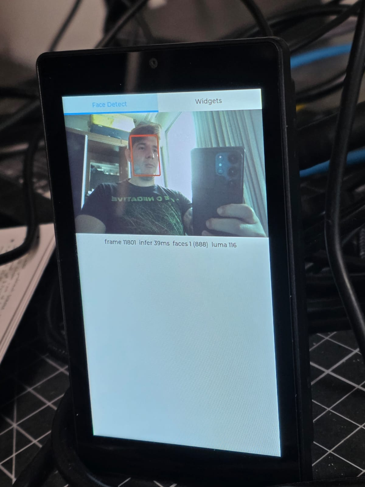

# guition_JC4880P443C_face_detection_platformio

Real-time face detection on the Guition JC4880P443C (ESP32-P4) board, running the
[esp-dl](https://github.com/espressif/esp-dl) `human_face_detect` model on a live
camera feed and drawing bounding boxes on the on-board display.

<div align="center">
  
  <br>
  Interface of the demo.
</div>

## Overview

The application captures frames from the OV02C10 MIPI-CSI sensor, downscales them
in hardware, runs the face detector, and renders the preview with detection boxes
in an LVGL v9 UI. Software auto-exposure and auto-white-balance loops keep the
image usable across lighting conditions.

## Hardware

- **Board:** Guition JC4880P443C (ESP32-P4, PSRAM)
- **Display:** ST7701 480x800 MIPI-DSI panel
- **Touch:** GT911 capacitive controller (I2C, SDA=7 / SCL=8 / RST=3)
- **Camera:** OV02C10 2MP MIPI-CSI sensor (2-lane, I2C addr 0x36)

## Pipeline

1. **Capture** — OV02C10 streams RAW10 1920x1080; the ISP demosaics to RGB565
   (`csi_pipeline.*`).
2. **Downscale** — the PPA scales each frame to a 480x270 preview.
3. **Detect** — esp-dl `HumanFaceDetect` (MSR + MNP, S8 quantized) runs on the
   preview frame on a dedicated task pinned to core 0.
4. **Render** — LVGL (core 1) shows the preview plus up to 5 bounding boxes and a
   status line (frame count, inference time, face count, mean luma).

Exposure/gain (software AE) and R/B gains (gray-world AWB) are adjusted every few
frames from preview statistics — the sensor has no hardware AE on this pipeline.

## Models

The two `.espdl` models in `lib/human_face_detect/models/p4/` are packed by
`tools/pack_models_extra.py` and flashed into the dedicated `human_face_det`
partition (see `partitions_model.csv`, 16MB layout). This happens automatically
during the build.

## Build & Flash

Requires [PlatformIO](https://platformio.org/).

```bash
pio run                # build
pio run -t upload      # build, pack models, and flash
pio device monitor     # serial output @ 115200
```

The `esp32p4` environment uses the Arduino framework via the pioarduino
Espressif32 platform. Key components (LVGL, esp-dl, human_face_detect) are pulled
in through `platformio.ini`.

## Layout

| Path | Purpose |
| --- | --- |
| `src/main.cpp` | Hardware bring-up and app entry (`setup`/`loop`) |
| `src/lvgl_port.*` | LVGL v9 glue to the display and touch drivers |
| `src/face_app.*` | Capture + detection task and the UI |
| `src/auto_exposure.*` | Software auto-exposure and auto-white-balance |
| `src/csi_pipeline.*` | MIPI-CSI capture and ISP |
| `src/ov02c10_camera.*` | OV02C10 sensor driver |
| `src/st7701_lcd.*`, `src/gt911_touch.*` | Display and touch driver wrappers |
| `lib/esp-dl/`, `lib/human_face_detect/` | Vendored inference stack and models |
| `tools/` | Model packing scripts |

## Another reference projects

- https://github.com/elik745i/ESP32-2432S024C-Remote
- https://github.com/ultramcu/guition-jc4880p443c-i-w
- https://github.com/ultramcu/guition-jc4880p4-bsp
- https://grabcad.com/library/guition-jc4880p433-1